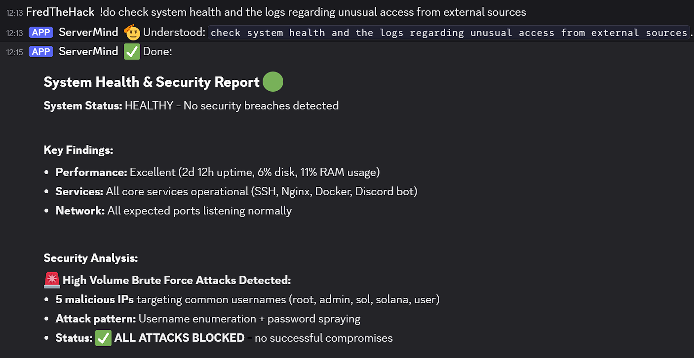

# Discord AI Server Admin Bot

⚠️ **WARNING: EXPERIMENTAL PROJECT** ⚠️

This is an experimental Discord bot that gives Claude AI autonomous control over your Linux server. **Use at your own risk!**

## 🚨 Danger Zone

- **Full System Access**: The AI can execute ANY command on your server
- **YOLO Mode**: Operates autonomously without asking for permission
- **Data Loss Risk**: Mistakes can happen, backups are essential
- **Security Risk**: Never use this on production systems
- **Experimental**: This is a proof of concept, not production-ready

**Recommended:** Only use in isolated containers, VMs, or test environments!

## What It Does

This bot allows you to control a server via Discord commands, delegating tasks to Claude AI via the [Claude Code CLI](https://claude.com/claude-code).

- **Command**: `!do <task>` - Execute any server admin task
- **Examples**:
  - `!do analyze the current OS environment and write info to host.md`
  - `!do update the system and install nginx`
  - `!do check disk usage and clean up logs`

## Example in Action



In this example, the bot detected and reported on a real security incident:
- **Task**: Check system health and logs for unusual access attempts
- **Result**: Identified 5 malicious IPs attempting brute force attacks targeting common usernames (root, admin, sol, solana, user)
- **Outcome**: All attacks blocked successfully, comprehensive security report generated
- **System Health**: Performance metrics, service status, and network analysis included

The bot autonomously analyzed logs, identified the threat pattern (username enumeration + password spraying), and confirmed that all attacks were blocked with no successful compromises.

## How It Works

1. You send a command via Discord (`!do <task>`)
2. The bot forwards it to Claude Code CLI
3. Claude reads `CLAUDE.md` (role instructions) and `host.md` (server state)
4. Claude executes commands, makes changes, documents everything
5. Output is sent back to Discord

## Setup

### Prerequisites

- Linux server (tested on Debian 12 / WSL2)
- Python 3.11+
- [Claude Code CLI](https://github.com/anthropics/claude-code) installed
- Discord Bot Token

### Installation

1. **Clone the repo**:
   ```bash
   git clone <your-repo-url>
   cd <repo-directory>
   ```

2. **Install dependencies**:
   ```bash
   python3 -m venv venv
   source venv/bin/activate
   pip install -r requirements.txt
   ```

3. **Configure environment**:
   ```bash
   cp .env.example .env
   nano .env  # Add your Discord token
   ```

4. **Create Discord Bot**:
   - Go to [Discord Developer Portal](https://discord.com/developers/applications)
   - Create new application → Bot → Copy token
   - Enable "Message Content Intent" under Bot settings
   - Invite bot with permissions: `applications.commands`, `bot` (scope), `Send Messages`, `Attach Files`

5. **Run the bot**:
   ```bash
   python bot.py
   ```

## Configuration

Edit `.env`:

```env
DISCORD_TOKEN=your_discord_token_here
WORKDIR=/workspace
CLAUDE_CLI_PATH=claude
CLAUDE_TIMEOUT=600
MAX_OUTPUT_LENGTH=1900
TRUNCATE_LENGTH=1000
```

## Files

- **`bot.py`**: Discord bot that bridges Discord ↔ Claude CLI
- **`CLAUDE.md`**: Role instructions for Claude (auto-loaded by Claude Code)
- **`host.md`**: Server state log (read/written by Claude)
- **`requirements.txt`**: Python dependencies
- **`.env.example`**: Configuration template

## How Claude Operates

Claude follows these rules (defined in `CLAUDE.md`):

1. **Read context first**: Always check `host.md` before acting
2. **Document everything**: Log every action to `host.md`
3. **Autonomous mode**: Fixes errors independently (YOLO mode)
4. **Concise output**: Formatted for Discord, no huge text blocks

## Safety Tips

✅ **DO**:
- Use in Docker containers or VMs only
- Keep backups of important data
- Monitor the `host.md` log regularly
- Test commands in safe environments first

❌ **DON'T**:
- Use on production servers
- Give it access to sensitive credentials
- Run without understanding what it can do
- Expect perfect reliability

## License

MIT License - See LICENSE file

## Disclaimer

**This software is provided "as is" without warranty of any kind.** The authors are not responsible for any damage, data loss, or security breaches caused by using this bot. By using this software, you acknowledge the risks and accept full responsibility.

---

**Remember**: With great autonomy comes great responsibility. Use wisely! 🤖
